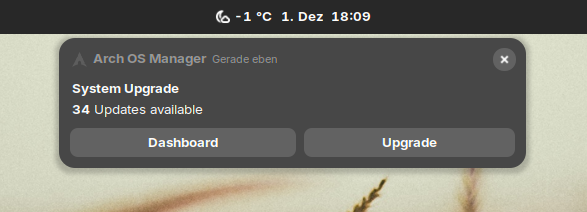
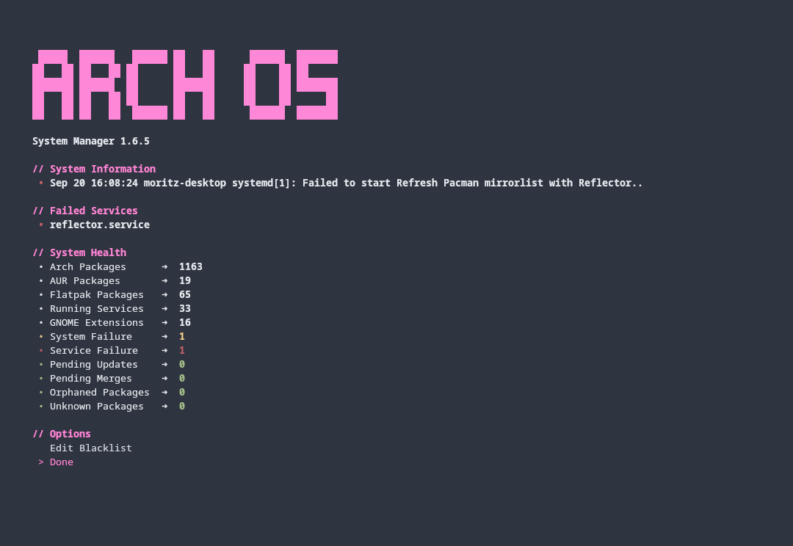
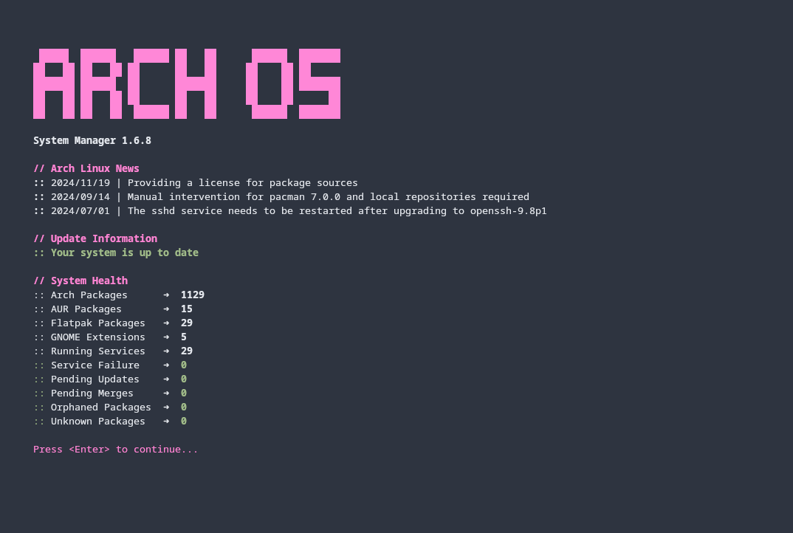

<div align="center">
  <h1>
    
    <p><b>Arch OS Manager</b></p>
  </h1>
</div>

<div align="center">
  
  <p></p>

**[ ➜ More Screenshots ](#screenshots)**

  <p>The Arch OS Manager is a tool for managing Arch Linux systems. It provides a straightforward interface for system administration and supports execution via tty or desktop. Offering features like system upgrade, package management, health monitoring and some more... </p>

  <p>
    
    
  </p>
  <p><sub>100% shellcheck approved</sub></p>
  <p><sub>powered by <a href="https://github.com/murkl/arch-os">Arch OS</a></sub></p>
</div>

## Install from AUR

1. Install Package **[ ➜ AUR/arch-os-manager](https://aur.archlinux.org/packages/arch-os-manager)**

2. Run Arch OS Manager:

```
arch-os
```

**Note:** Add parameter `-k` to start with built-in kitty in standalone mode

## Install from GitHub

1. Install [Dependencies](#install-dependencies):

```
sudo pacman -S git base-devel pacman-contrib
```

2. Clone GitHub Repo:

```
git clone https://github.com/murkl/arch-os-manager.git && cd arch-os-manager
```

3. Run Arch OS Manager:

```
./arch-os
```

**Note:** Add parameter `-k` to start with built-in kitty in standalone mode

## Features

- Check & list updates in _checkupdates_ format
- Rich startup notification on available updates
- Dashboard: System health info, packages & logs
- Show unread/latest Arch Linux news
- Notice on orphaned packages & pacdiff files
- Search & manage packages
- Manage system & user services
- Upgrade system packages
- Remove orphaned packages
- Clear Package cache
- Reset Pacman keyring
- Built-in system log blacklist
- Built-in config editor
- Standalone mode with built-in kitty
- System-oriented design

Install these **optional** dependencies to equip Arch OS Manager with additional features:

- `paru`: Add support for manage AUR packages
- `libnotify`: Add notification support
- `flatpak`: Add support for manage Flatpak packages
- `reflector`: Add support for refresh Pacman mirrorlist
- `downgrade`: Add support for downgrade packages
- `meld`: Add support for merge pacdiff configurations
- `xdg-utils`: Add support for open news in browser
- `gnome-shell-extensions`: Add support for GNOME Extensions

**Note:** _see [Install Dependencies](#install-dependencies) for more information_

## Usage

The manager can be opened regularly with `arch-os` or in standalone mode with `arch-os --kitty`.

```
arch-os [--kitty | -k] [action]
```

**Note:** If no parameter is specified, the main menu is opened.

### App Actions

```
help             ➜  Open help page
version          ➜  Print version info
config           ➜  Edit config in built-in ediitor
```

### System Actions

```
check            ➜  Print package updates (checkupdates)
notify           ➜  Notify on new package updates (autostart)
dashboard        ➜  Show dashboard (logs, services, health)
upgrade          ➜  System upgrade (news, health, pacman, aur, flatpak)
package          ➜  Search & manage packages (pacman, aur)
service          ➜  Manage services (system & user)
orphans          ➜  Remove orphaned packages (pacman, aur, flatpak)
merge            ➜  Merge updated configurations (pacdiff, meld)
refresh          ➜  Refresh & edit pacman mirrorlist (reflector)
downgrade        ➜  Downgrade packages (pacman)
cache            ➜  Clear package cache (pacman, aur)
reset            ➜  Reset pacman keyring & upgrade (pacman)
```

### Install Dependencies

Use parameter `--install` to install and preconfigure **all required packages** from the Arch OS Manager.

#### Install & Set Font

Install and set font for fancy icons:

```
sudo pacman -S ttf-firacode-nerd
gsettings set org.gnome.desktop.interface monospace-font-name 'FiraCode Nerd Font 10'
```

#### Pacman Packages (mandatory)

```
git base-devel pacman-contrib
```

#### Binary Packages (mandatory)

These packages are downloaded to `~/.arch-os/bin`:

- `gum` ➜ [GitHub Release](https://github.com/charmbracelet/gum/releases)
- `kitty` ➜ [GitHub Release](https://github.com/kovidgoyal/kitty/releases)

#### Pacman Packages (optional)

```
reflector libnotify fzf xdg-utils meld
```

#### AUR Packages (optional)

These packages are built and installed manually from the AUR-Git repository using `makepkg`:

- paru (see `AUR_MANAGER_REPO` property for more details)
- downgrade

Paru is preconfigured in `/etc/paru.conf`. Old configurations are copied to `/etc/paru.conf.20240919170446`, for example (before editing).

## Config

Edit the config with the built-in editor in Arch OS Manager or edit the config file manually.

```
CONTENT_MAX_WIDTH=110                 # Cut text after width in packages & logs (min: 50)
CONTENT_MAX_HEIGHT=16                 # Max lines in packages & downgrade (max: 100)
REFLECTOR_COUNTRY=none                # Set prefered reflector country (example: Germany,France)
ARCH_UPGRADE_CONFIRM=true             # Enable confirm upgrade system packages (experimental) (disable: false)
ARCH_DOWNLOAD_TIMEOUT=false           # Disable pacman/paru download timeout (enable: true)
AUR_SUPPORT=true                      # Enable AUR support (disable: false)
AUR_MANAGER_REPO=paru                 # Set AUR manager package for --install (paru, paru-bin, paru-git)
AUR_REVIEW=false                      # Disable AUR review (enable: true)
FLATPAK_SUPPORT=true                  # Enable flatpak support (disable: false)
FLATPAK_UPGRADE_ENABLED=false         # Disable flatpak upgrade to use GNOME Software instead (enable: true)
FLATPAK_UPGRADE_CONFIRM=false         # Disable confirm flatpak upgrade (experimental) (enable: true)
AUTOSTART_NOTIFY=true                 # Enable update notify on system boot (disable: false)
AUTOSTART_DELAY=30                    # Delay update check after boot in seconds (min: 10)
ORPHANS_CONFIRM=false                 # Disable confirm remove orphans (enable: true)
NEWS_QUANTITY=3                       # Number of news to shown (disable: 0)
UPGRADE_SHOW_HEALTH=false             # Show health view in upgrade (enable: true)
HEALTH_ENABLE_UNKNOWN_PKG_LIST=false  # Show unknown package counter instead of name list (enable: true)
HEALTH_SHOW_LOG=true                  # Show system log in healt (disable: false)
DASHBOARD_SHOW_LOG=true               # Show system log in dashboard & health (disable: false)
DASHBOARD_SHOW_SERVICES=true          # Show running services in dashboard (disable: false)
DASHBOARD_SHOW_USER_SERVICES=false    # Show user services in dashboard & health (enable: true)
```

### Configuration Files

- Arch OS Manager config: `~/.arch-os/config/settings.conf`
- Built-in kitty config: `~/.arch-os/config/kitty.conf`
- System log blacklist: `~/.arch-os/config/blacklist.conf`

## Integrate GNOME Extension

1. Install GNOME Extension **[➜ archlinux-updates-indicator](https://extensions.gnome.org/extension/1010/)**

2. Set `Check command`:

```
dconf write /org/gnome/shell/extensions/arch-update/check-cmd "'/usr/bin/arch-os check'"
```

3. Set `Update command`:

```
dconf write /org/gnome/shell/extensions/arch-update/update-cmd "'arch-os --kitty upgrade'"
```

4. Set `Package Manager` (optional):

```
dconf write /org/gnome/shell/extensions/arch-update/package-manager "'arch-os --kitty'"
```

<div align="center">

## Screenshots

<sub><b>This screenshots may outdated.</b></sub>

<p></p>
<p></p>
<p></p>
<p></p>
<p></p>
<p></p>

</div>

## Development

```
# Start with custom binaries (gum & kitty)
GUM=/my/custom/gum KITTY=/my/custom/kitty ./arch-os

# Install dependencies
./arch-os --install

# Init Arch OS Manager (dirs & files)
./arch-os --init

# Sync all databases
./arch-os --sync
```

## Credits

- https://archlinux.org
- https://github.com/RaphaelRochet/arch-update
- https://github.com/Morganamilo/paru
- https://github.com/kovidgoyal/kitty
- https://github.com/charmbracelet/gum
- https://github.com/archlinux-downgrade/downgrade
- https://meldmerge.org
