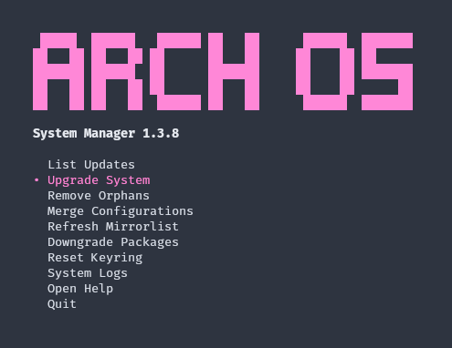

<div align="center">
<h1>
  
  <p><b>Arch OS Manager</b></p>
</h1>

### Dependencies

**`paru pacman-contrib kitty gum libnotify ttf-firacode-nerd`**

### Install

**[aur/arch-os-manager](https://aur.archlinux.org/packages/arch-os-manager)**

### Run

**`arch-os`**

<br>

<p></p>

</div>

<br>

### GNOME Extension

1. Install GNOME Extension: **[archlinux-updates-indicator](https://extensions.gnome.org/extension/1010/)**
2. Set `Check command`:

```
dconf write /org/gnome/shell/extensions/arch-update/check-cmd "'/usr/bin/arch-os --check'"
```

3. Set `Update command`:

```
dconf write /org/gnome/shell/extensions/arch-update/update-cmd "'arch-os --upgrade'"
```

4. Set `Package Manager` (optional):

```
dconf write /org/gnome/shell/extensions/arch-update/package-manager "'arch-os'"
```

<br>

<div align="center">

<p>


</p>

<sub><b>100% shellcheck approved</b></sub>

<sub><b>used by <a href="https://github.com/murkl/arch-os">Arch OS</a></b></sub>

</div>
