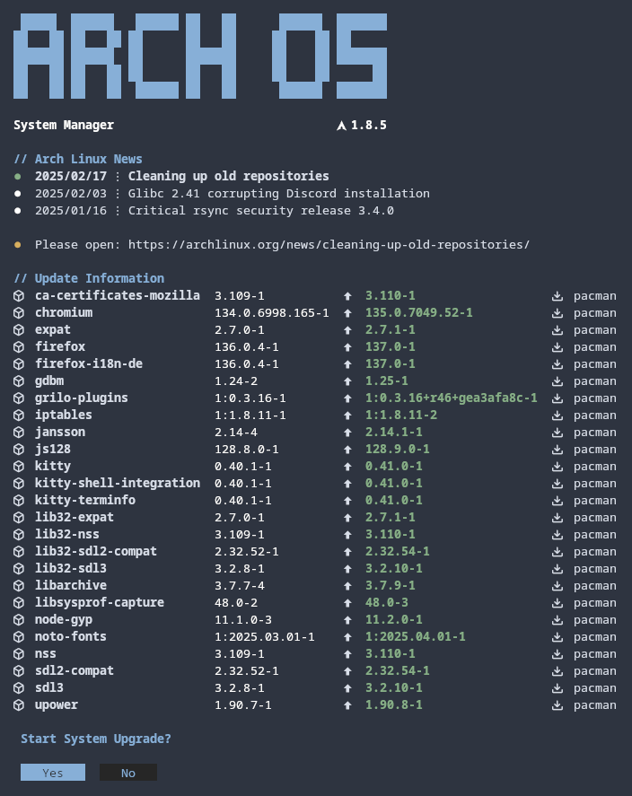

<div align="center">
<h1>
  
  <p><b>Arch OS Manager</b></p>
</h1>
</div>

<div align="center">

<b>Dependencies</b>

**`paru pacman-contrib kitty gum libnotify ttf-firacode-nerd`**

<b>Install</b>

**[aur/arch-os-manager](https://aur.archlinux.org/packages/arch-os-manager)**

<b>Run</b>

**`arch-os`**

<br>

<p></p>

<p>


</p>

<sub><b>100% shellcheck approved</b></sub>

<sub><b>used by <a href="https://github.com/murkl/arch-os">Arch OS</a></b></sub>

</div>

## Settings

```
ARCH_NEWS_COUNT=3                     # Number of news to shown (Disable: 0)
ARCH_NEWS_URL_ENABLED=true            # Show 'More info url' below the news (Disable: false)
FILTER_RESULT_SIZE=20                 # Max filter results
PACKAGE_INFO_WIDTH=80                 # Max info width (cut horizontal output)
AUR_REVIEW_ENABLED=false              # Disable AUR review (Enable: true)
FLATPAK_SUPPORT_ENABLED=true          # Enable Flatpak Support (Disable: false)
FLATPAK_UPGRADE_CONFIRM_ENABLED=false # Disable flatpak upgrade confirm (Enable: true)
ORPHANS_CONFIRM_ENABLED=false         # Disable confirm remove orphans (Enable: true)
UPGRADE_CONFIRM_ENABLED=true          # Enable confirm upgrade system packages (Disable: false)
```

**Note:** The config file is located here: `~/.arch-os/arch-os.conf`

## Integrate GNOME Extension

1. Install GNOME Extension: **[archlinux-updates-indicator](https://extensions.gnome.org/extension/1010/)**
2. Set `Check command`:

```
dconf write /org/gnome/shell/extensions/arch-update/check-cmd "'/usr/bin/arch-os check'"
```

3. Set `Update command`:

```
dconf write /org/gnome/shell/extensions/arch-update/update-cmd "'arch-os --kitty upgrade'"
```

4. Set `Package Manager` (optional):

```
dconf write /org/gnome/shell/extensions/arch-update/package-manager "'arch-os --kitty'"
```

## Screenshots

<div align="center">





</div>
